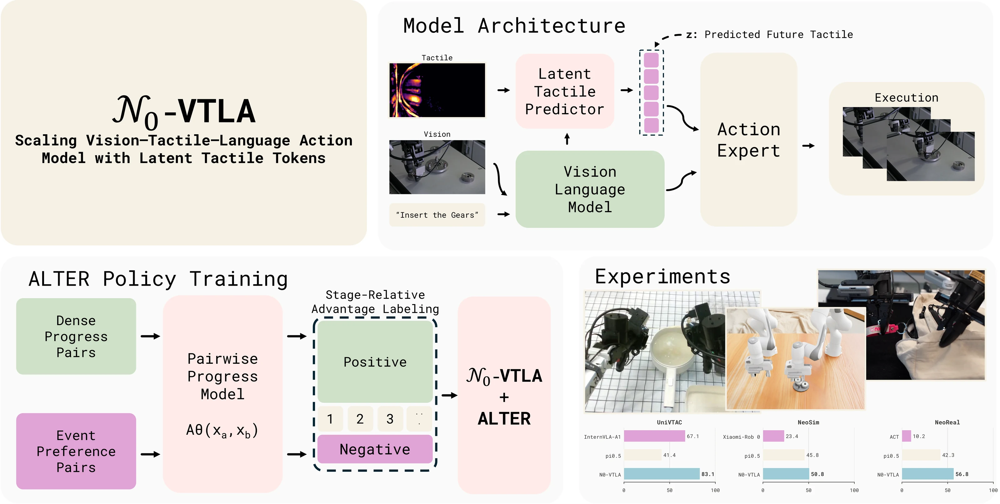
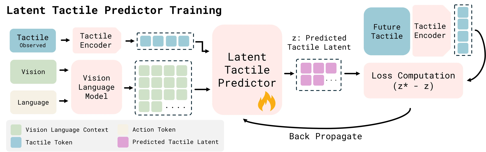

<div align="center">

<h1>𝒩₀-VTLA</h1>

<p><b>用潜在触觉 Token 扩展视觉-触觉-语言-动作模型</b></p>

<p>
  <a href="README.md">English</a> &nbsp;·&nbsp; <b>中文</b>
</p>

<p>
  <a href="https://research.neoteai.com/n0-vtla/"></a>
  <a href="https://arxiv.org/abs/2607.23782"></a>
  <a href="https://huggingface.co/NeoteAI/n0-vtla-base"></a>
  <a href="LICENSE"></a>
  
</p>

<h2>🔥 𝒩₀-VTLA 已正式发布！🔥</h2>

<p><strong>预训练 checkpoint、后训练工具链和推理服务现已开放。</strong></p>



</div>

$\mathcal{N}_0$-VTLA 是一个视觉-触觉-语言-动作策略，为预训练的视觉-语言-动作（VLA）模型加上触觉。
它不把触觉图像当作额外的相机流送入视觉塔，而是**预测潜在触觉 token**，即对未来一个动作块内接触
变化的紧凑编码，并直接以此为条件驱动 flow matching 动作专家。力、滑动、以及“对准”与“卡住”的
区别，在视觉上往往很微弱，但触觉能直接观测到；潜在触觉通路把这个信号交给策略。

本仓库发布模型、后训练工具箱和推理服务端，你可以加载我们的预训练权重，把 $\mathcal{N}_0$-VTLA
适配到自己的机器人和任务上。大规模预训练流程不包含在内。

## 功能

- 在你自己的视触觉演示数据上后训练预训练 checkpoint（`train.sh`）。详见 [POST_TRAINING.md](docs/POST_TRAINING.md)。
- 把 episode 转换成 canonical 32 维表示并计算归一化统计（`scripts/convert_canonical_data.py`、`scripts/compute_canonical_norm.py`）。
- 通过 websocket 为真机部署策略，或通过 ZMQ 为仿真部署（`scripts/serve_policy.py`、`scripts/serve_zmq.py`）。详见 [DEPLOY.md](docs/DEPLOY.md)。
- 检查触觉通路是否真的在起作用，以及关闭触觉时模型是否与基础策略字节等价（`scripts/probe_z_tactile_dependence.py`、`scripts/gate_c_check.py`）。

## 模型概要

| 组件 | 选择 |
|---|---|
| 主干 | PaliGemma（gemma_2b）prefix + Gemma（300m）动作专家 |
| 目标函数 | 50 步动作块上的 flow matching |
| 触觉编码器 | 冻结的 DINOv2（`facebook/dinov2-base`），输入为基线差分图像 |
| 触觉通路 | Cross-attention 预测器 → 5 个潜在 token，注入动作专家 |
| 动作空间 | Canonical 32 维容器（双臂 EEF 位置 + rot6d + 夹爪） |
| 精度 | bf16 参数，eager attention 以对齐预训练计算路径 |

<p align="center">
  
  <br><em>每帧触觉图像先与零接触基线做差，经冻结的 DINOv2 编码，再蒸馏成若干潜在 token，
  概括未来一个动作块内的接触变化。</em>
</p>

触觉通路**默认关闭，且关闭时与基础策略字节等价**，因此在打开触觉分支之前，$\mathcal{N}_0$-VTLA checkpoint
的加载与运行和标准基础策略完全一致。`scripts/gate_c_check.py` 会在 state_dict 键、前向 loss 和采样
动作三个层面断言这一等价性。

## 目录结构

```
N0-VTLA/
├── n0vtla/                 # 模型包
│   ├── models_pytorch/     # N0VTLAPolicy、触觉编码器/预测器、transformers_replace
│   ├── policies/           # 各形态的输入输出变换、canonical schema
│   ├── training/           # 配置、数据加载、优化器
│   └── transforms.py       # 归一化、delta 动作、tokenize
├── n0vtla_client/          # 机器人侧客户端库
├── scripts/                # 训练、服务、转换、验证
├── docs/                   # 安装、后训练、部署
└── train.sh                # 后训练启动脚本
```

## 安装

Python 3.11 + 支持 CUDA 的 GPU。`transformers_replace` 补丁与 DINOv2 缓存两步都是必需的，
完整流程见 [INSTALL.md](docs/INSTALL.md)。

```bash
conda create -n vtla python=3.11 -y && conda activate vtla
pip install -r requirements.txt && pip install -e . --no-deps
cp -r n0vtla/models_pytorch/transformers_replace/* \
  "$CONDA_PREFIX/lib/python3.11/site-packages/transformers/"
```

## 📦 模型下载

| Checkpoint | 内容 | 配置 |
|---|---|---|
| [🤗 n0-vtla-base](https://huggingface.co/NeoteAI/n0-vtla-base) | 预训练底座，后训练的起点 | `vtla_tactile_posttrain` |
| [🤗 n0_VTLA_insert_hole](https://huggingface.co/NeoteAI/n0_VTLA_insert_hole) | UniVTAC 单臂策略，关节动作 | `sim_single_arm_tactile` |
| [🤗 n0_VTLA_dual_bowl_place_stack](https://huggingface.co/NeoteAI/n0_VTLA_dual_bowl_place_stack) | NeoSim 双臂策略，关节动作 | `sim_dual_arm_tactile` |

```bash
hf download NeoteAI/n0-vtla-base --local-dir checkpoints/n0-vtla-base
export VTLA_PRETRAINED_CHECKPOINT="$PWD/checkpoints/n0-vtla-base"
```

`VTLA_PRETRAINED_CHECKPOINT` 必须指向**直接包含** `model.safetensors` 的目录。

底座权重是**用于后训练的预训练底座，不是可直接部署的策略**。它带有任务策略所需的触觉编码器、
潜在触觉预测器和投影参数，但没有在任何任务上微调过。

## 快速开始：在自己的数据上后训练

```bash
export VTLA_DATASET_PATH=/path/to/datasets/canonical_tactile_task
export VTLA_ASSET_ID=canonical_tactile_task
export EXP_NAME=my_experiment

CHECK_ONLY=1 bash train.sh     # 预检：GPU 数、checkpoint、数据集、norm 统计、DINOv2 缓存
bash train.sh --overwrite
```

转换 episode、计算归一化统计、配置、训练这四步的完整说明，连同 canonical 32 维布局和常见问题，
都在 [POST_TRAINING.md](docs/POST_TRAINING.md)。

## 推理服务

```bash
# 真机，websocket
python scripts/serve_policy.py \
  --policy.config=vtla_tactile_posttrain \
  --policy.dir=checkpoints/vtla_tactile_posttrain/<实验名>/<训练步>

# UniVTAC 仿真，ZMQ
VTLA_ASSET_ID=n0_insert_hole_norm python scripts/serve_zmq.py \
  --config sim_single_arm_tactile \
  --ckpt checkpoints/n0_VTLA_insert_hole \
  --addr "tcp://*:5557" --default-prompt "insert hole"
```

请**完整执行**返回的动作块后再请求下一次预测。执行步长不足会丢掉每个块的尾部，而夹爪闭合指令
正在尾部。详见 [DEPLOY.md](docs/DEPLOY.md)。

## 主要特性

- **预测触觉，而非像素。** 触觉证据以少量*预测出的*潜在 token 进入策略，表示即将发生的接触变化，
  而不是把原始图像塞进视觉塔解码。
- **基线差分输入。** 每帧触觉图像减去该回合的零接触基线，编码器看到的是接触*变化*而非原始凝胶图像。
- **零初始化门控。** 潜在 token 经一个从零开始的门注入动作专家，训练从基础策略的行为精确起步，
  触觉通道逐步打开。
- **多机器人共用一个动作空间。** 固定的 32 维容器让单臂、双臂和手持夹爪三类形态共享同一个动作目标。

NeoData 上的大规模预训练、三阶段训练配方、部署期（RL）改进流程以及实验结果，均见
[论文](https://arxiv.org/abs/2607.23782)。

## 引用

```bibtex
@misc{n0vtla2026,
      title={$N_0$-VTLA: Scaling Vision-Tactile-Language-Action Model with Latent Tactile Tokens}, 
      author={NeoteAI Team and Fudan TEAI Team},
      year={2026},
      eprint={2607.23782},
      archivePrefix={arXiv},
      primaryClass={cs.RO},
      url={https://arxiv.org/abs/2607.23782}, 
}
```

## 致谢

$\mathcal{N}_0$-VTLA 构建于 [OpenPI](https://github.com/Physical-Intelligence/openpi) 框架之上，
触觉编码使用 [DINOv2](https://github.com/facebookresearch/dinov2)，数据处理使用
[LeRobot](https://github.com/huggingface/lerobot)。

## 许可

**本仓库的原创内容**基于 [CC BY-SA 4.0](LICENSE) 发布。第三方组件保留其原有许可：
Apache-2.0 组件已在 [NOTICE](NOTICE) 中列明，完整许可文本见 [LICENSES/Apache-2.0.txt](LICENSES/Apache-2.0.txt)。

**模型权重不适用该许可。** 发布的 $\mathcal{N}_0$-VTLA 权重派生自 Google 的 PaliGemma/Gemma 参数，因此按
[Gemma Terms of Use](https://ai.google.dev/gemma/terms) 与
[Gemma Prohibited Use Policy](https://ai.google.dev/gemma/prohibited_use_policy) 提供。这一约束
继承自基座模型，并非我们额外附加。
